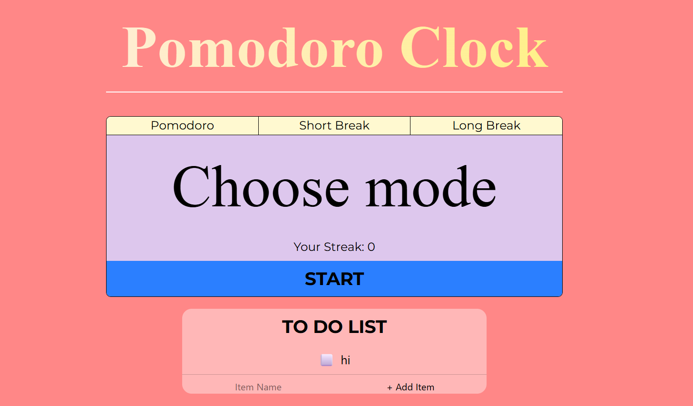

# Pomodoro Clock

Just a small project to review my knowledge

To experience this website, you should do the following steps:
  +  Clone this project through HTTPS
  +  Open terminal and paste `npm install tailwindcss @tailwindcss/cli`
  +  Then paste this `npx @tailwindcss/cli -i ./src/input.css -o ./src/output.css --watch`
  +  If you don't have the extension live server, you need to download it.
  +  Click the live server icon in the right below and you can see my project.

Hope you enjoy it.

